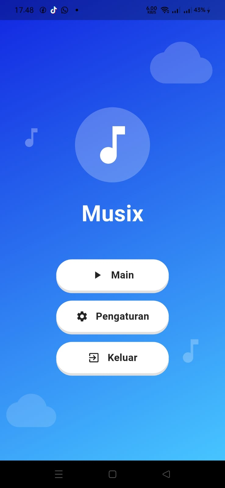
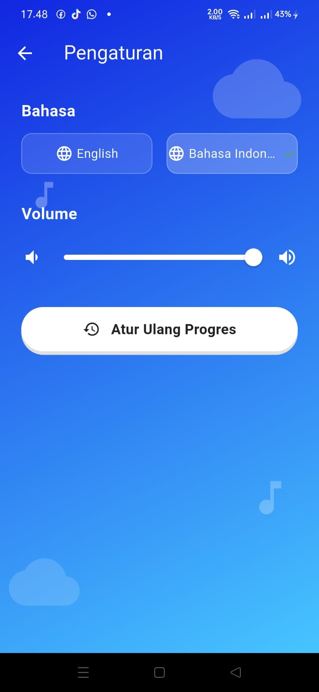
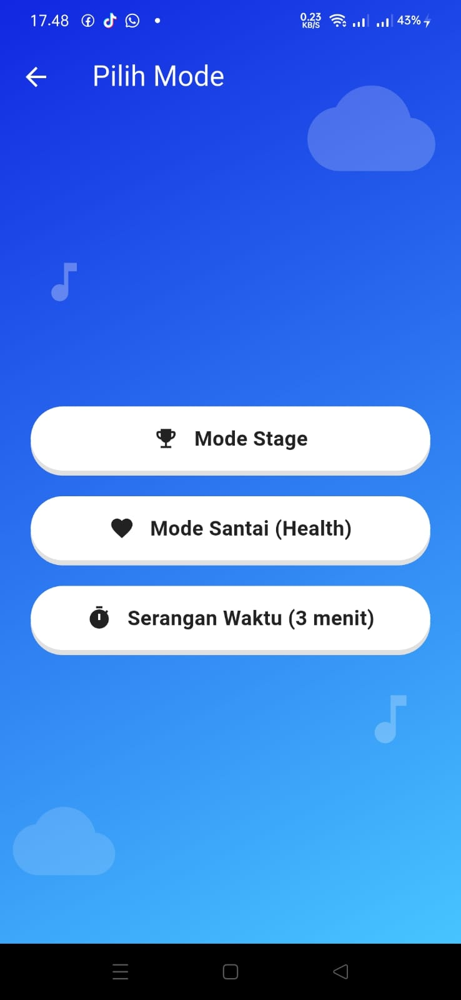
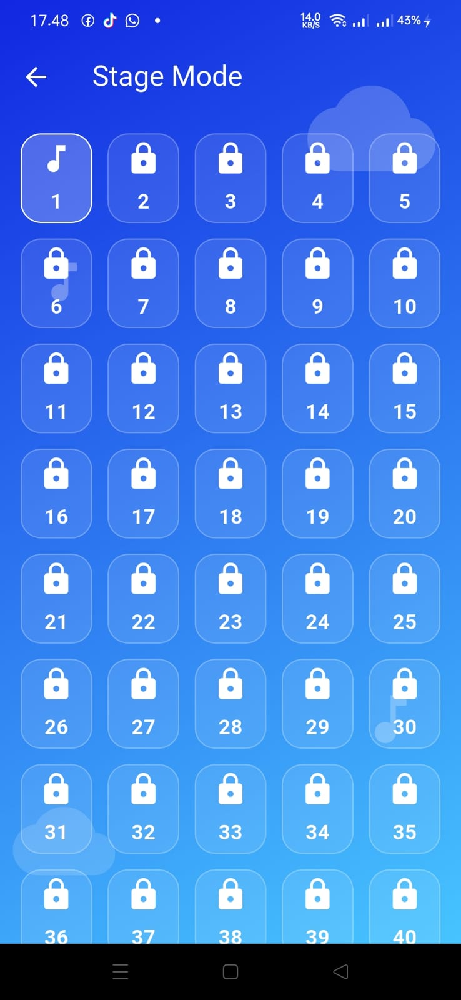
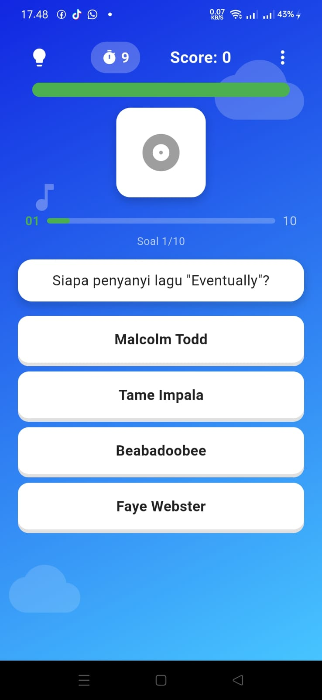
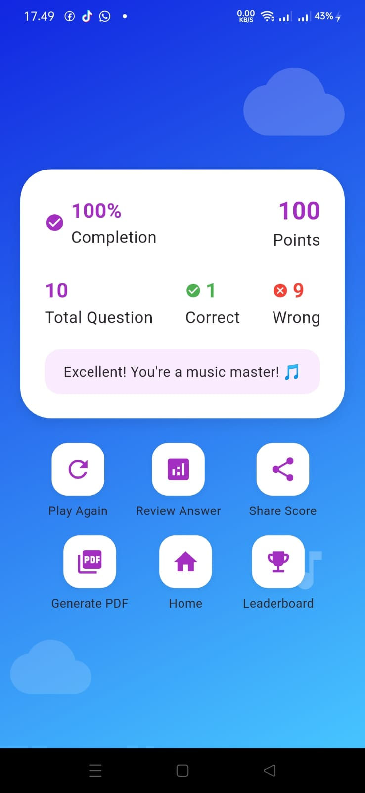

# 🎵 Musix - Music Quiz Game


**Musix** adalah aplikasi kuis musik interaktif yang dirancang untuk menguji dan memperluas pengetahuan musik Anda. Aplikasi ini menawarkan tiga mode permainan yang unik, dilengkapi dengan database lagu lokal yang ekstensif dan antarmuka pengguna yang modern dan intuitif.

### Scrum ClickUp
https://app.clickup.com/90181774309/v/s/901810294593

### UI Prototype
https://www.figma.com/design/Ei6DklA8fZEAxLRygJhKq8/Ui?node-id=0-1&t=LjPyzSL6XdVwRBPR-1

### UX flow
https://www.figma.com/design/WSpBYKxro71GX4kyUoPhsI/Untitled?node-id=0-1&t=8LXK3SoNCOpOeYuW-1 

## Tampilan Aplikasi
### Home
.

### Settings
.

### Mode Select
.

### Stage Select
.

### Quiz
.

### Result
.


## ✨ Fitur Utama

### 🎮 Tiga Mode Permainan
- **Mode Stage (Career)**: Taklukkan 100 stage secara berurutan. Setiap stage yang berhasil diselesaikan akan membuka stage berikutnya.
- **Casual Mode (Health Bar)**: Mulai dengan 100 poin kesehatan. Setiap jawaban salah akan mengurangi kesehatan, dan terkadang "event" tiba-tiba dapat melipatgandakan damage yang diterima.
- **Time Attack (3 Minutes)**: Uji kecepatan dan pengetahuan Anda dengan menjawab sebanyak mungkin pertanyaan dalam waktu 3 menit.

### 🧩 Elemen Gameplay
- **💡 Sistem Hint**: Dapatkan petunjuk untuk mempermudah menjawab pertanyaan sulit.
- **⚡ Random Event Multiplier**: Saat menjawab salah, ada kemungkinan muncul event yang melipatgandakan damage (x2 atau x5) yang diterima.
- **🏆 High Score**: Simpan dan catat skor tertinggi Anda untuk setiap mode permainan.

### 🌐 Pengalaman Global
- **🌍 Deteksi Lokasi & Bahasa Otomatis**: Aplikasi secara otomatis mendeteksi lokasi perangkat Anda dan mengatur bahasa (Indonesia/Inggris) serta menampilkan bendera yang sesuai.
- **⚙️ Pengaturan Lengkap**: Ubah bahasa aplikasi dan atur volume musik latar sesuai keinginan Anda.

### 🗄️ Manajemen Data
- **🎵 Database Lagu Lokal (SQLite)**: Aplikasi ini sudah dilengkapi dengan database yang berisi lebih dari 50 lagu dari berbagai genre dan artis.
- **🔊 Audio Playback**: Nikmati cuplikan lagu asli saat menjawab pertanyaan.

## 🛠️ Teknologi yang Digunakan

- **Framework**: [Flutter](https://flutter.dev/) (SDK 3.0.0+)
- **Bahasa**: Dart
- **Database**: [sqflite](https://pub.dev/packages/sqflite) untuk penyimpanan lokal lagu, progres stage, dan skor tertinggi.
- **Audio**: [audioplayers](https://pub.dev/packages/audioplayers) untuk memutar cuplikan lagu.
- **Lokalisasi & Deteksi Lokasi**: [easy_localization](https://pub.dev/packages/easy_localization) dan [world_info_plus](https://pub.dev/packages/world_info_plus) untuk deteksi bahasa otomatis.
- **Lokasi**: [geolocator](https://pub.dev/packages/geolocator) untuk mengakses izin lokasi perangkat.
- **Animasi UI**: [flutter_animate](https://pub.dev/packages/flutter_animate) dan [lottie](https://pub.dev/packages/lottie) untuk animasi splash screen yang halus.

## 📋 Prasyarat

Sebelum memulai, pastikan lingkungan development Anda telah memenuhi persyaratan berikut:

- [Flutter SDK](https://docs.flutter.dev/get-started/install) (versi 3.0.0 atau lebih baru)
- [Android Studio](https://developer.android.com/studio) atau [VS Code](https://code.visualstudio.com/) dengan ekstensi Flutter
- Perangkat fisik Android (disarankan) atau emulator untuk menjalankan aplikasi

## 🚀 Cara Menjalankan Proyek

Ikuti langkah-langkah berikut untuk menjalankan aplikasi **Musix** di perangkat Anda:

1.  **Clone repositori ini**
    ```bash
    git clone https://github.com/Celtdinho/Musix.git
    cd Musix
    ```
    
2. **Instal dependensi Flutter**
   ```bash
   flutter pub get
   ```
   
3. **Jalankan aplikasi**
   ```bash
   flutter run
   ```
   
**Catatan Penting:**
Proyek ini menggunakan Git Large File Storage (LFS) untuk menyimpan file aset audio yang berukuran besar. Pastikan Anda telah menginstal Git LFS sebelum melakukan clone.

```bash
git lfs install
git clone https://github.com/Celtdinho/Musix.git
```

## 🎯 Cara Bermain
Pilih Mode: Di layar utama, Anda dapat memilih salah satu dari tiga mode permainan.

Mulai Kuis: Sebuah pertanyaan akan muncul beserta empat pilihan jawaban. Anda juga akan mendengar cuplikan lagu yang berkaitan dengan pertanyaan.

Jawab dengan Cermat: Pilih jawaban yang menurut Anda benar.

Dapatkan Skor:

Stage Mode: Kumpulkan poin untuk membuka stage berikutnya.

Casual Mode: Jaga kesehatan Anda. Hindari jawaban salah dan waspadai event yang dapat melipatgandakan damage.

Time Attack Mode: Kecepatan adalah kunci. Jawab secepat mungkin untuk mendapatkan skor setinggi-tingginya sebelum waktu habis.

Gunakan Hint: Jika Anda merasa kesulitan, gunakan tombol hint untuk mendapatkan bantuan.

Lihat Skor Akhir: Setelah kuis selesai, skor akhir Anda akan ditampilkan.

## 🤝 Kontribusi
Kontribusi untuk pengembangan Musix sangat terbuka. Jika Anda ingin melaporkan bug, mengusulkan fitur baru, atau meningkatkan kode, silakan buat issue atau pull request di repositori GitHub ini.

Fork repositori ini.

Buat branch fitur baru (git checkout -b fitur-anda).

Commit perubahan Anda (git commit -m 'Menambahkan fitur baru').

Push ke branch (git push origin fitur-anda).

Buka Pull Request.

## 📄 Lisensi
Proyek ini dilisensikan di bawah Lisensi MIT - lihat file LICENSE untuk detail lebih lanjut (jika ada).

Selamat bermain dan asah pengetahuan musik Anda dengan Musix! 🎧✨

text

## 💡 Cara Menggabungkan

Karena file `README.md` yang sudah ada sebelumnya (masih berisi template Flutter default) tidak dapat diakses secara langsung untuk diedit, Anda dapat menggabungkannya dengan mudah melalui langkah-langkah berikut:

1.  **Buka proyek Anda** di editor teks (misalnya, VS Code, Android Studio).
2.  **Buka file `README.md`** yang terletak di direktori *root* proyek (folder yang sama dengan `pubspec.yaml`).
3.  **Pilih dan hapus semua** konten yang sudah ada di dalam file `README.md`.
4.  **Salin seluruh kode README** yang telah disediakan di atas.
5.  **Tempelkan kode tersebut** ke dalam file `README.md` yang sudah kosong.
6.  **Simpan** file tersebut.

Setelah selesai, Anda dapat melakukan *commit* dan *push* perubahan ini ke repositori GitHub Anda. Dengan begitu, halaman utama repositori Anda akan menampilkan README yang informatif dan profesional.

Semoga membantu! Jika ada bagian yang perlu disesuaikan, beri tahu saya.
